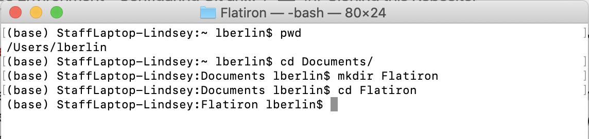
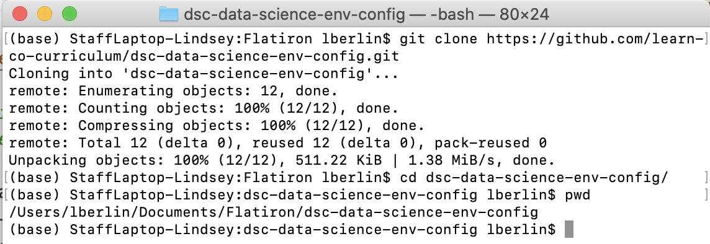
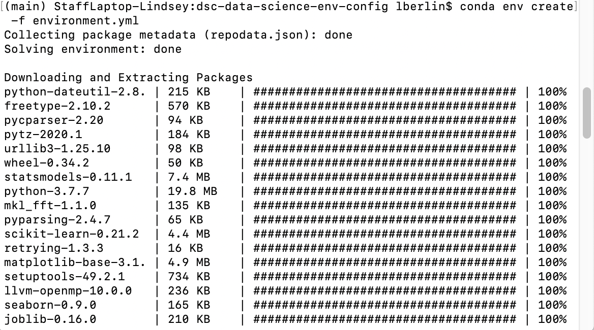

# Setting up a Professional Data Science Environment - Configuring Git and Anaconda

## Introduction

In this lesson, you'll continue setting up your professional data science environment by configuring your terminal to work with GitHub, making a virtual environment, and setting up your virtual environment to open by default from your terminal. 

## Objectives

You will be able to:

* Use basic commands to navigate the command line
* Practice utilizing Git and GitHub
* Summarize why virtual environments are used
* Set up a virtual environment

## Connecting Your Terminal to GitHub

Now that you have Git installed locally, you'll be often working back and forth between GitHub, a service which hosts Git repositories online, and your local computer. To better integrate with GitHub, you should set up your name and email address:

1. In your terminal window\*, type `git config --global user.name`

    - If it returns your name, you’re set! 
    - If it returns nothing or displays an error message, type `git config --global user.name “Your Name”` - replacing Your Name with your name inside the quotes (this should be your real first and last name, not your GitHub username)

2. In your terminal window, type `git config --global user.email`

    - If it returns your email address, you’re set! 
    - If it returns nothing or displays an error message, type `git config --global user.email your@email.com` - replacing your@email.com with your email address

\* Remember, when we say "terminal" we mean the Terminal app for Mac, and the Git Bash program for Windows

## Cloning this Repository

To complete the later steps in this configuration process, you’re going to need to download a copy of the files in this repository, so we should do this now since you already have a terminal window open.

You should get in the habit of checking exactly where you are in your Terminal before downloading anything. Use the command `pwd` to print your working directory. If you're not in a place you want to download lessons, you should navigate to a place you want to keep your Flatiron repositories and files. 

If you have not used the command line much or at all, follow the below steps:

1. Open a new terminal window
2. Type `pwd` - this should show your home directory, the most basic of paths on your computer
3. Type `cd Documents` - this will change your directory, and move you into your Documents folder
4. Type `mkdir Flatiron` - this will create a new folder, called Flatiron, to keep all of your Flatiron repositories and files
5. Type `cd Flatiron` - this will change your directory, moving you into the new Flatiron folder you just created

MacOS Example:

> ## Important Note
>
> You should **NEVER** clone a Git repository into another Git repository!
>
> You can always check if you are currently in a Git repository by running `git status`. If you get an error that says "`fatal: not a git repository (or any of the parent directories): .git`", then you are not in a Git repository.

Once you are in a good place to download files from GitHub, like a general folder to keep all of your Flatiron repositories and files, type (or better still, copy and paste) `git clone https://github.com/learn-co-curriculum/dsc-data-science-env-config.git`

_In Windows, in Git Bash, to paste from the clipboard the shortcut should be **ctrl-shift-insert**_

This will create a new subdirectory whose name is "dsc-data-science-env-config" which will contain a copy of all of the files in this repository!

Move into that directory using the `cd`, or change directory, command (after typing `cd dsc` you should be able to hit the **tab** key to "tab complete" so you don't need to type the whole directory name). 

Now, if you run `pwd` to print your working directory again, you should be inside the folder we just cloned down from that GitHub link!

MacOS Example:

## Setting Up Virtual Environments

As you do data science projects, you will spend a lot of your time using pre-written libraries to speed up your development. Examples include NumPy, Pandas and scikit-learn. As you work on different projects, you may also find that you end up using different versions of different libraries for different projects. The most common versioning issue is that some projects will run in Python 2 whereas others will run in Python 3, but you may also find that different projects depend on different versions of libraries like Tensorflow.

Occasionally, code that works in an old version of a library won’t work in a newer version. So if you open up a new project and install the dependencies, it’s possible that your old project won’t work anymore.

To avoid that problem, a best practice is to use “virtual environments”. Virtual environments allow you to have different versions of Python and different versions of the various libraries you use, so you can install a new version of a library for one project but still use the old version for another project. It’s almost as if you have multiple computers that you can swap between, each having a different setup and configuration, just by running a couple of commands.

There is a built-in virtual environment feature in Python, but we’re going to use the more flexible virtual environments provided by Conda as part of the Anaconda distribution you installed.
To use a new virtual environment, there are two steps you need to complete. The first step is to create the virtual environment. That may take a couple of minutes as your computer has to download the necessary version of Python and all of the libraries that you want to be able to use in that environment. The next step then is to “use” the virtual environment by activating it.

If you want to learn more about Conda environments, have a look at the [documentation](https://conda.io/docs/user-guide/tasks/manage-environments.html), otherwise, let’s give this a try.

### Creating the Conda Virtual Environment

You need to start by navigating into this project folder. If you run `pwd` to print your working directory in your terminal, you should be inside the folder we cloned down. If the name of the current working directory is not "dsc-data-science-env-config", then you need to move into that folder - follow the steps above.

Then to create the environment, type `conda env create -f environment.yml`. Depending on the speed of your computer and your internet connection it may take up to five minutes for this to complete. While it does you should see output similar to that displayed below start to appear in your terminal.

MacOS Example:

Next, try activating the environment. Type `conda activate learn-env`.

To confirm that it worked, type `conda info --envs` and confirm that the output in the terminal ends with "/learn-env" - For example, : `/Users/peterbell/anaconda3/envs/learn-env`

#### Troubleshooting

If you see a message that states “WARNING: A newer version of Conda exists”, run `conda update -n base conda` and then try again to create the environment using `conda env create -f environment.yml`.

If you see a message that states "file not found", double check that you are running this command from the directory that contains the .yml file. If you type `ls` you should see the environment.yml file. If you don't see it, you likely forgot to run `cd dsc-data-science-env-config` to change into the right directory.

## Setting your Default Environment

You have successfully created your virtual environment! But, to be sure that you are using the learn-env, it's helpful to set it as your default environment so that you don't need to remember to manually switch to it every time you open the terminal. This step is highly recommended but not required.

### Mac

On a Mac, we need to first see what shell you're running in your terminal. Run `echo $SHELL`.

If the response ends in `bash`:

- run `echo "conda activate learn-env" >> ~/.bash_profile` to add the configuration to your bash profile and then run `source ~/.bash_profile` to activate the changes you just made

### Windows

To follow these instructions on a Windows machine you must be using the Git Bash shell it was suggested to install above.

1. Run `touch ~/.bash_profile` to create a new file. 
2. Run `echo "conda activate learn-env" >> ~/.bash_profile` to add the configuration to your bash profile
3. Run `source ~/.bash_profile` to activate the changes you just made

## Updating your Virtual Environment

Every so often we create new versions of the virtual environment and we'll ask you to update your virtual environment. To do that, download the latest version of this repository with the latest changes. Then go into a terminal window and:

## Configuring your Kernel

Jupyter Notebooks run "kernels" - the computational engine used for executing your code. It's important to be running the right kernel within your notebook, otherwise you may get errors stating that you don't have a particular package or have the wrong version of it or even complaints about the version of Python you're running (some packages that work with Python 3.6.6 don't support Python 3.7, for example).

It is essential to run `conda activate learn-env` every time you start a new terminal window if you do not set your terminal to activate that environment by default. If you don't do this you **will** get errors, so please check this first. 

There is one more step you need to perform. Firstly you need to ensure your terminal is running the learn-env virtual environment so you have the necessary packages. Then you need to go into your Jupyter Notebook and when viewing a notebook, click on "Kernel" in the top bar, then "Change Kernel" and then pick the learn-env kernel. You must make sure you're running the learn-env kernel whenever you're working in a Jupyter Notebook.

If for any reason you don't see the learn-env option in the drop-down list of kernels, exit the notebook in the browser, close down the notebook server from the terminal, and in the terminal type `python -m ipykernel install --user --name=learn-env` - that will add the learn-env to your list of kernels and when you restart the Jupyter Notebook server and then open a notebook, you'll be able to select the learn-env option from the list of kernels.

## Summary

Congratulations! If you've gotten this far and everything has worked, you have successfully set up a virtual environment which will serve as a great baseline setup for working as a professional data scientist!
